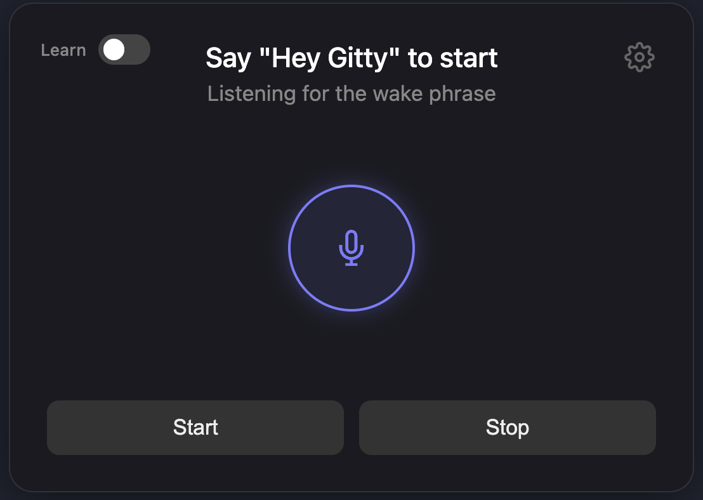
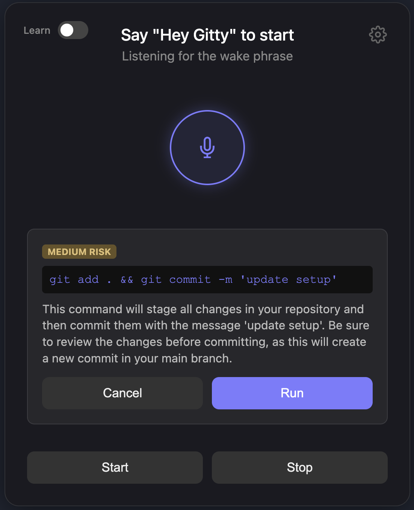
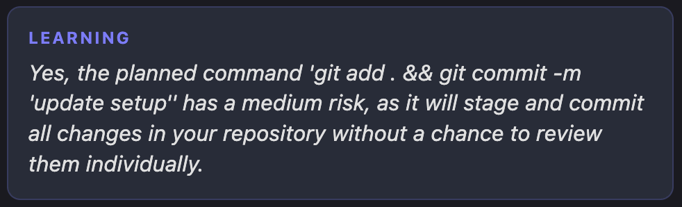

# 🎙️ Gitty

### Your Voice Controlled Git Extension in VS Code

> **A safer, calmer, and more human way to work with Git using voice and AI**

---

## 🧭 Overview

**Gitty** is a VS Code extension that turns Git into a voice driven workflow.

Instead of memorizing commands or worrying about destructive actions, developers simply explain what they want to do in plain English. Gitty listens, understands repository context, explains the outcome, evaluates risk, and only executes commands when it is safe or when the user explicitly approves.

You always see what will happen before anything runs.

No silent execution  
No guessing  
No Git anxiety

Built for **McHacks13**.

---

## 💡 Why Gitty Exists

Git is powerful, but it is intimidating.

In co ops and industry environments, a single mistake can break production, wipe changes, or cause a panic message in Slack. Even experienced developers pause before running high impact commands.

Gitty exists to remove that hesitation.

By explaining actions in plain language and enforcing confirmations, Gitty makes Git safer without slowing developers down.

---

## 👤 Who Gitty Is For

Gitty is designed for developers at every stage.

Beginners who want to learn Git without fear  
Intermediate developers managing multiple branches  
Professionals working on production codebases

If you have ever thought  
“Am I about to break something”  
Gitty is for you.

---

## 🖼️ Demo and Screenshots





---

## ✨ Key Features

| Feature               | Description                                              |
| --------------------- | -------------------------------------------------------- |
| 🎙️ Voice to Git       | Speak natural language instead of Git syntax             |
| 👂 Wake Word          | Activate Gitty with “Hey Gitty”                          |
| 🧠 Context Awareness  | Understands branch state, changes, and repository status |
| 💬 Clear Explanations | Every command is explained before execution              |
| ⚠️ Risk Detection     | Commands labeled low medium or high risk                 |
| 📘 Learning Mode      | Explore Git safely with guided explanations              |
| 🗣️ Text to Speech     | Gitty speaks feedback using ElevenLabs                   |
| 🖥️ VS Code Native     | Built directly into the editor                           |

---

## 🧠 How It Works

```
User Speaks
↓
Vosk Speech Recognition
↓
Wake Word Detection
↓
Repository Context Snapshot
↓
Groq LLM Intent Planning
↓
Risk Assessment and Explanation
↓
User Confirmation
↓
Git Command Execution
↓
Visual and Spoken Feedback

```

---

## ⚙️ Installation and Setup

```bash
# from root
npm install
npm run compile
```

### Python (Vosk STT)

```bash
# create venv in repo
python3 -m venv .venv
source .venv/bin/activate

# dependencies
pip install --upgrade pip
pip install vosk==0.3.42 sounddevice numpy webrtcvad
```

### Porcupine Model

Navigate to the [Picovoice console](https://console.picovoice.ai/ppn), set the wake word as "Hey Gitty" and download the model by clicking "Train".

Unzip and place the .ppn file into:

```
resources/porcupine/
```

### Vosk Model

Download + unzip a Vosk English model into:

```
resources/vosk-model/<model-folder>/
```

Example:

```
resources/vosk-model/vosk-model-small-en-us-0.15/
```

Download the models from [here](https://alphacephei.com/vosk/models)

---

### VS Code Settings (JSON)

Open: `Cmd+Shift+P` → **Preferences: Open Settings (JSON)**

```json
{
	"gitty.voice.enabled": true,
	"gitty.picovoice.accessKey": "<YOUR_PICOVOICE_ACCESSKEY>",
	"gitty.vosk.enabled": true,

	"gitty.groq.enabled": true,
	"gitty.groq.model": "llama-3.3-70b-versatile",
	"gitty.groq.apiKey": "<YOUR_API_KEY>",

	"gitty.elevenlabs.enabled": true,
	"gitty.elevenlabs.voiceId": "<YOUR_VOICE_ID>",
	"gitty.elevenlabs.modelId": "eleven_turbo_v2_5",
	"gitty.elevenlabs.outputFormat": "mp3_22050_32",
	"gitty.elevenlabs.speed": 1.05
}
```

### Store ElevenLabs API Keys (Secret Storage)

Run from Command Palette (`Cmd+Shift+P`):

- **Gitty: Set ElevenLabs API Key**

### Run locally (dev)

- Open the repo in VS Code
- Press **F5** to launch the **Extension Development Host**
- In the Dev Host: `Cmd+Shift+P` → **Gitty: Open Coach** → **Start button**

---

## 🗣️ Example Voice Commands

| Risk Level | What You Say                                                 |
| ---------- | ------------------------------------------------------------ |
| 🟢 Low     | Hey Gitty, check the status                                  |
| 🟡 Medium  | Hey Gitty, commit all changes with the message update README |
| 🔴 High    | Hey Gitty, move my last commit to a new branch               |

Gitty always explains actions before running them.

---

## 🧪 Learning Mode

Learning Mode allows users to explore Git without fear.

- Ask questions about commands
- See explanations in plain English
- Toggle on or off at any time

Perfect for onboarding and education.

---

## 👥 Contributors

### Team Gitty

- Paurav Hosur Param
- Vivek Reddy
- Daniaal Tahir Mahmood

Built for **McHacks13**.

---

## 🪪 License

This project is licensed under the MIT License.

---

## 🧭 Vision

Git should feel empowering, not stressful.

Gitty brings clarity and confidence to version control by letting developers speak naturally, understand actions clearly, and stay in control at every step.

See before you run.  
Understand Git.  
Build without fear.
